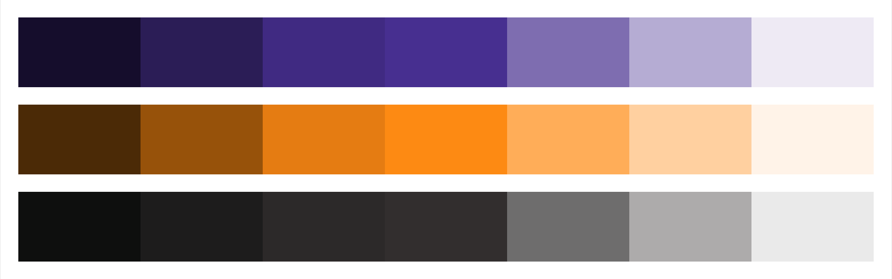

# Menyoo Brand Guide

## Assets

### Logos

- [PNG/JPG](/assets/logo/)


## Color Pallet

```sass
$dark-slate-blue: #472F90
$dark-orange: #FD8A11
$text: #312E2E
$text-light: #616368
$white: #FFFFFF
```

### Color Shades



```js
'brand-blue-lightest' : '#EDEAF4',
'brand-blue-lighter' : '#B5ACD3',
'brand-blue-light' : '#7E6DB1',
'brand-blue' : '#472F90',
'brand-blue-dark' : '#402A82',
'brand-blue-darker' : '#2B1C56',
'brand-blue-darkest' : '#150E2B',
```

```js
'dark-orange-lightest' : '#FFF3E7',
'dark-orange-lighter' : '#FED0A0',
'dark-orange-light' : '#FEAD58',
'dark-orange' : '#FD8A11',
'dark-orange-dark' : '#E47C0F',
'dark-orange-darker' : '#98530A',
'dark-orange-darkest' : '#4C2905',
```

```js
'grey-lightest' : '#EAEAEA',
'grey-lighter' : '#ADABAB',
'grey-light' : '#6F6D6D',
'grey' : '#312E2E',
'grey-dark' : '#2C2929',
'grey-darker' : '#1D1C1C',
'grey-darkest' : '#0F0E0E',
```

## Typography

#### Lato Medium
https://fonts.google.com/specimen/Lato

#### Crimson Text
https://fonts.google.com/specimen/Crimson+Text


## Changelog

- [v1](https://github.com/vicainelli/menyoo-brand-guide/releases/tag/v1.0)
